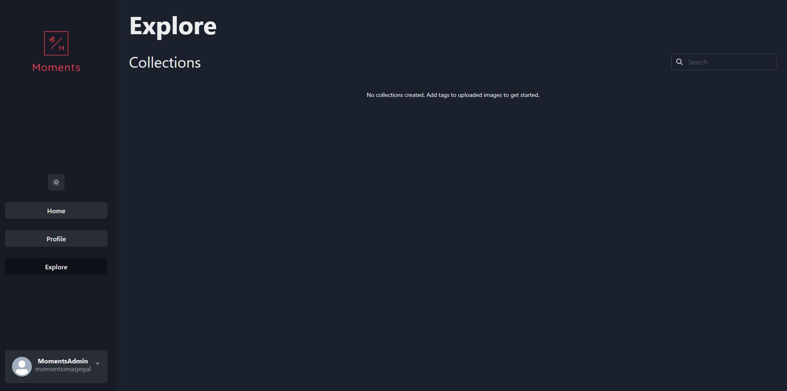

# 🖼️ Moments

## ⚒️ Pre-requisites

- Node v18
- Code IDE
- AWS Account
- MongoDB Account

## 💭 Environment Variables

Please refer to the `dev.env` files located under `./client` and `./server`. Insert variables for each file and then rename those files to `.env`.

AWS deployments require AWS credentials to be set in their respective `credentials` and `config` files. Refer to Amazon's documentation [here](https://docs.aws.amazon.com/cli/latest/userguide/cli-configure-files.html).

## 🎨 Stack

### Front-end

- React
- TypeScript
- Node.js
- Chakra UI

### Back-end

- Node.js
- React
- TypeScript
- Express.js
- Mongoose
- MongoDB (server)

### Cloud

- AWS
- Netlify
- GoDaddy
- Github

## 📄 Scripts

### To add git hooks
```sh
npx simple-git-hooks
```

### To install packages -- this will install all packages for front-end and back-end
```sh
npm install
```

### To add a package for front-end
```sh
yarn workspace client <package-name>
```

### To add a package for back-end
```sh
yarn workspace server <package-name>
```

### To run front-end ONLY
```sh
yarn workspace client start
```

### To build front-end
```sh
yarn workspace client build
```

### To run back-end ONLY
```sh
yarn workspace server start
```

### To build the back-end
```sh
yarn workspace server build
```

### To run cloud services ONLY
```sh
yarn workspace aws start
```

### To deploy cloud services
```sh
yarn workspace aws deploy
```

### Lint Repository
```sh
yarn lint
```

### Lint Client
```sh
yarn workspace client lint
```

### Lint Server
```sh
yarn workspace server lint
```

## 🖼️ Gallery

### Landing Page


### Login Page


### Register Page


The following is showed with dark mode enabled.

### Upload Page


### Profile Page


### Explore Page

